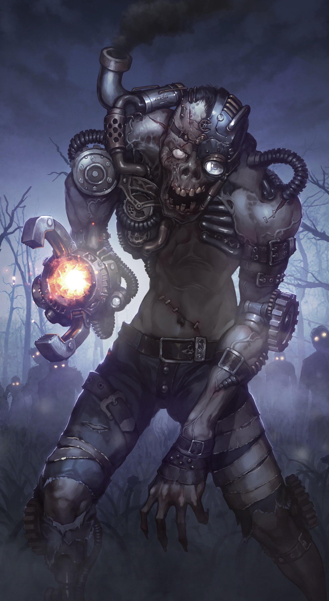

# World Background
[Getting Started](http://c3ptoh.github.io/secrets-of-nelluon/getting-started)  
[Session Notes](http://c3ptoh.github.io/secrets-of-nelluon/session-notes)  
[World Background](http://c3ptoh.github.io/secrets-of-nelluon/world-background)

This mini-campaign takes place in the Nelluon Triangle region east of the Isles of Meropis in the world of Alfheimr. The history of this world is vast, with many implications from previous campaigns played in this world. For details about historical timelines, major world events, and current politcal conditions, refer to this [campaign primer written by Matt Hale](matt-hale-homebrew-background.pdf). 

Reading this earlier primer will help with understanding the world that this campaign takes place in, but here are some highlights that are important from that primer:
- Virtually all cities and states are under the control of the #New-Arklan-Imperium, led by #Kurgal, a necromancer Litch supreme ruler. Under their rule, necromantic practices become the norm, and "long life" clinics help individuals with ternimal illnesses stay alive. However, as time passed since the establishment of these practices, those who die a mortal death tend to come back as "zombies" who can contribute to society in the form of menial labor (e.g., rowing boats) for around 5-7 years.
- In the area of the world that this mini-campaign takes place in, Elves are the most dominant civilization at play. The large country of #Valance is home to High Elves and is generally north of where the Isles of Meropis is.
- The Meropis Isles (see image below) are a series of islands that have historically been rather lawless, home to pirates, thieves, and outcasts, but has since fallen under the control of the #Chronos-Concord, a regional power mostly interested in establishing trade in the region, taming the lawlesness that has plagued these isles, and is now affiliated with the #New-Arklan-Imperium . The #Chronos-Concord doesn't "rule" over these Islands with an iron fist, and much illegal activity still goes on in these isles. Of note, are the pirates that roam the seas and make their home in #Darktides-Wake, and the #Manifold, a large and powerful criminal organization (e.g., the Mafia of the Isles).

- The native people of the #Spice-Islands are the #Kekehuna. Not much is known about their connection to the Nelluon Triangle where this mini-campaign takes place, but their ties to the region run deep, and there are many secrets in these lands that they hold the key to.

## The Nelluon Triangle.
The region that you were will adventuring in is colloquially known as the Nelluon Triangle (from the Elvish word for "hidden"). The exact location, geography, and ecosystem of this region is largely unknown to this day, but scholars have pinpointed the general location East of the #Aera Floating Islands (off the map above) as the most likely home of such a region. This area of the world is unmapped, and numerous scouting expeditions have failed to properly identify the immediate area east of #Aera. The far east areas beyond the Isles of Meropis is known to be wide open sea. However, several anecdotal accounts of these scouting parties have reported the "appearance" of a vague landmass spotted in an area of the ocean that has historically believed to be uninhabited. Similar stories of an ephemeral series of islands have been told by the #Kekehuna in their oral tradition, but the exact nature of these hidden islands remains a mystery. 

More modern expeditions (within the last 200 years) into that region have failed in 1 of 3 ways:
- the expedition doesn't return- they are nowhere to be found,
- a member of the expedition attempts to send a message back to Meropis via magical means (e.g., sending) but the message is so garbled or confusing that the only snippets that have ever been retrieved from these messages are along the lines of "--unbelievable land formations--", "--creatures beyond comprehension--", or "--send help immediately--", and 
- remnants of body parts identified as belonging to a member of the expedition are found floating among ship debris washed up on the #Wild-Isles or on the coast of #Faerûnëar . 

Because of the extremely unsuccessful and dangerous nature of these expeditions, most efforts to map out this region have tapered off within the last 50 years. Once in awhile, a drunk pirate in a local tavern may recount the "tale of the lost city of diamonds", and may brag about their next adventure plundering the riches of this mysterious region, but most of that is just talk. Even hardened adventurers stay away from that region because of the risk of disappearing forever.

Years pass, and what was once a promising area for exploration and plundering has now faded in the collective consciousness of the region. Promises of untold wealth left behind by an ancient civilization have dissolved in the fullness of time, giving way to a cloud of apathy about what goes on in the Nelluon Triangle. If brought up now in serious conversation, most shrug it off as "ghost stories from the sea", "a pointless waste of life and gold". 

Until now. 

## Necro-Magitech: A growing field
Recent discoveries by the #Department-of-Applied-Magitech, a recently-formed quasi-military research unit sponsored by the #Valance government, have revealed some startling discoveries about the region. Advances in #Necro-magitech, a sub-discipline of the field that focuses on "leveraging magitech for use in undead beings in the service of national security and peace" have led to the development of #Synthetically-Enhanced-Undead-Intelligence-and-Tactical (SUIT) units that can serve as surveyors into hostile environments, test subjects in dangerous experiments, and last but not least, military troops with specialized abilities (see image below for example): 

These SUIT Units (also known colloquially as #SUITS or "robot zombies") have allowed surveying parties to expand their activities to very remote areas of #Arklan, often in regions never heard of before. One particular type of #SUITS unit that lends itself well to surveying work are those that are implanted with visual enhancers, such as magical lenses that transfer information between receiving stations, camera-trap-style observation stations that automatically detect movement or changes in the environment, and recon "drones" that are sent out to surveil hard-to-reach areas. Since much of this work is highly classified, the results of these initiatives are unknown to most citizens, but there is a general sense that these advancements in magitech have the potential to bring about positive change in the region. However, there is a small but vocal group of scientists that have recently begun to question the ethics of developing and using #SUITS for scientific endeavors. 

Of particular concern to this campaign are the results from a preliminary field study conducted by the #Department-of-Applied-Magitech that have revealed strange land formations in the once-highly-coveted Nelluon Triangle region. Importantly, a contingent of #SUITS Units that were equipped with the latest magitech that allows real-time adaptive triangulation of matter over large areas of water (a modified and high intensity version of "Gaze of Two Minds") were deployed to the area east of #Aera. The results of this survey yielded low-resolution images of the boundary of a circular land-mass appearing once every 6 months in the world calendar. Scholars have posited several theories about this phenomenon, with the most widely accepted one being that the two moons ( #Io and #Selune) fall into the exact same axis once every six months, creating a high-tide in the western reaches of Alfheimr and a low-tide toward the east, revealing underwater land-masses in very low-lying regions. 

However, not much is known about the exact nature of this land-mass, what it contains, and how to access it again since the #SUITS Units deployed on this mission disappeared mysteriously shortly after transmitting their preliminary findings to research stations near #Faerûnëar. However, in addition to the exact locations and timing of this phenomenon, these units were able to detect high concentrations of #Residuum elements in the region, indicating a potential #Residuum source somewhere on this circular land-mass. Given that the #Department-of-Applied-Magitech's primary resource is #Residuum, a raw material that can be refined for use in magical applications, fully surveying the region and securing the #Residuum resource is of utmost priority. However, not willing to deploy additional prototype #SUITS (highly resource intensive to develop), the department decided to subcontract further surveying work in this dangerous region to a third-party specializing in navigation and mining. 

## The East Acheron Company
![[EAC_logo.png|400]]
Founded in 1173 P.C. (almost 50 years ago) under the sponsorship of the #Chronos-Concord, with the primary mission of further settling the Meropis Isles and developing safe trade routes in the region, the #East-Acheron-Company occupies a unique role at the intersection of diplomacy, trade, and security. Primarily staffed by former members of the Concord military, recent changes in leadership have led to an increased focus on sourcing #Residuum from the region. Growing trade relationships and increased Magitech activities have led to skyrocketing demand for the precious resource. Due to the specialized nature of mining #Residuum, the #East-Acheron-Company have developed efficient and effective methods for mass-mining this substance for use in the magical industry, far outpacing all other competitors. 

Even though the #East-Acheron-Company is legally an independent for-profit organization, its ties to the #Chronos-Concord have resulted in a public perception that the company and the concord are one and the same. This same perception also permeates through the company itself, with many employees adopting a sense of loyalty to the Concord and taking to heart the company motto: 

> **"sharti nha aer, sharti nha faen"**
> Rougly translated to "Where there is order, there is life." 

Indeed, many young mercantile and adventuring types are drawn to the company's lofty ideals of taming the Isles of Meropis, bringing law and order to the land, seeking riches and fame, and mining resources for advancement of society. Even though the company has many ties to the military, it is primarily organized as a for-profit company, with shareholder interests dominating company priorities and strategy. 

For this upcoming expedition into the Nelluon Triangle, the company has hand-selected promising members of the expedition, with the hopes that it will succeed in mapping the region, identifying #Residuum deposits, and establishing mining operations. The preliminary results from the #SUITS mission have been shared with this expedition, and the precise timing and coordinates of the appearance of this land mass have been calculated. All that's left to do is send out the best team and wait for their return. 

## Your Role in the World
You are one such adventurer, answering the #Department-of-Applied-Magitech's call for explorations into the Nelluon Triangle, under the banner of the #East-Acheron-Company . You are each free to develop your own backstory of how you came to work for the #East-Acheron-Company, but each of you have been assigned to this expedition in one capacity or another. 

This is what you know:

Your expedition will be equipped with advanced mining equipment, the latest experimental necro-magitech #SUITS to assist with the job, and the full support and backing of the #Chronos-Concord. If your expedition manages to successfully establish a mining source for #Residuum in the Nelluon Triangle, you have been promised many accolades and potential for promotion to leadership. 

You start your adventure on the ship bound for the Nelluon Triangle. The estimated time of travel to the coordinates supplied is approximately 5 weeks from the port of #Kalum, on the eastern-most edge of #Acheron. Your expedition is led by #Captain-Pelanor (Elias Pelanor), an experienced high-elf in the company that specializes in navigating dangerous waters. He is especially known for a string of very successful expeditions to the south of the #Aera, making him particularly well-suited to leading this expedition. Your party has minimal experience with #Captain-Pelanor, but many in the company know of his unique "leadership style" that emphasizes positivity, creative thinking, and innovative management techniques. 

**Now go forth and adventure!** 
